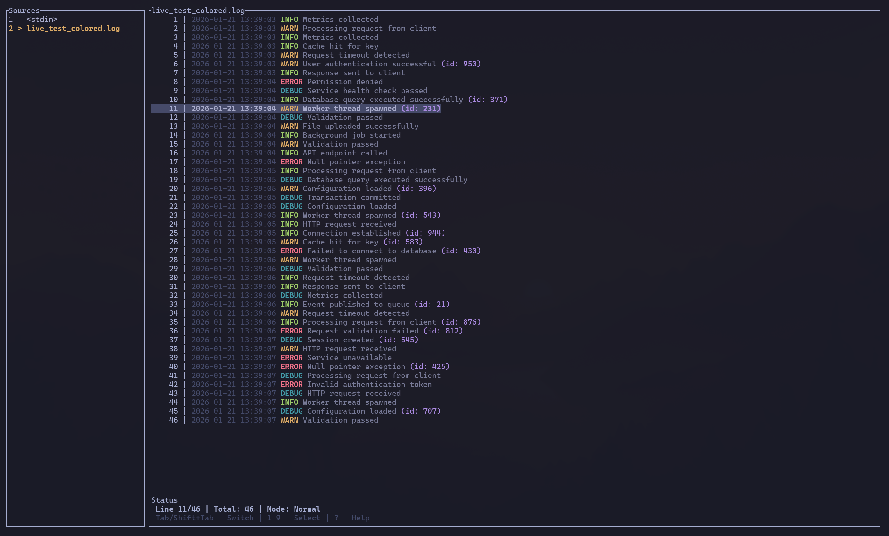

# LazyTail - Terminal-Based Log Viewer

A fast, universal terminal-based log viewer with live filtering, follow mode, and **AI assistant integration via MCP**.



## Installation

```bash
curl -fsSL https://raw.githubusercontent.com/raaymax/lazytail/master/install.sh | bash
# or
wget -qO- https://raw.githubusercontent.com/raaymax/lazytail/master/install.sh | bash
```

That's it! The script auto-detects your OS and architecture, downloads the latest release, and installs to `~/.local/bin`.

<details>
<summary>Alternative installation methods</summary>

### Custom install directory

```bash
curl -fsSL https://raw.githubusercontent.com/raaymax/lazytail/master/install.sh | INSTALL_DIR=/usr/local/bin bash
```

### Arch Linux (AUR)

```bash
yay -S lazytail
```

### Build from source

Requires Rust 1.70+:

```bash
git clone https://github.com/raaymax/lazytail.git
cd lazytail
cargo install --path .
```

</details>

## AI Assistant Integration (MCP)

LazyTail works as an [MCP (Model Context Protocol)](https://modelcontextprotocol.io/) server, letting AI assistants like **Claude**, **Codex**, and **Gemini** search and analyze your log files.

<details>
<summary><b>Claude Code Setup</b></summary>

```bash
claude mcp add lazytail -- lazytail --mcp
```

Or with scope for all projects:
```bash
claude mcp add lazytail --scope user -- lazytail --mcp
```

Verify with `claude mcp list` or `/mcp` command inside Claude Code.

</details>

<details>
<summary><b>OpenAI Codex Setup</b></summary>

Add to `~/.codex/config.toml`:

```toml
[mcp_servers.lazytail]
command = ["lazytail", "--mcp"]
```

Verify with `codex mcp` or `/mcp` command inside Codex.

</details>

<details>
<summary><b>Gemini CLI Setup</b></summary>

```bash
gemini mcp add lazytail -- lazytail --mcp
```

Or add to `~/.gemini/settings.json`:

```json
{
  "mcpServers": {
    "lazytail": {
      "command": "lazytail",
      "args": ["--mcp"]
    }
  }
}
```

Verify with `/mcp` command inside Gemini CLI.

</details>

### Available MCP Tools

| Tool | Description |
|------|-------------|
| `list_sources` | Discover available logs from `~/.config/lazytail/data/` |
| `search` | Find patterns (plain text or regex) with optional context lines |
| `get_tail` | Get the last N lines from a log file |
| `get_lines` | Read lines from a specific position |
| `get_context` | Get lines surrounding a specific line number |

### What You Can Ask Your AI

Once configured, ask your AI assistant:

- *"What errors are in the API logs?"*
- *"Search for 'connection refused' in all logs"*
- *"Show me the last 100 lines of the worker log"*
- *"What happened around line 1234?"*

### Capture Logs for AI Analysis

```bash
# Capture your application logs
kubectl logs -f my-pod | lazytail -n "MyApp"

# Now your AI can discover and search "MyApp" logs via MCP
```

## Features

- **Multi-tab support** - Open multiple log files in tabs with side panel navigation
- **Stdin support** - Pipe logs directly with auto-detection (`cmd | lazytail`)
- **Lazy file reading** - Efficiently handles large log files using indexed line positions
- **TUI interface** - Clean terminal UI with ratatui
- **Live filtering** - See results instantly as you type with regex or plain text
- **Filter history** - Navigate and reuse previous filter patterns
- **Background filtering** - Non-blocking filtering keeps UI responsive
- **File watching** - Auto-reload when log file is modified (using inotify on Linux)
- **Follow mode** - Auto-scroll to show latest logs as they arrive (like `tail -f`)
- **ANSI color support** - Parses and renders ANSI escape codes in full color
- **Line expansion** - Expand long lines for better readability
- **Memory efficient** - Viewport-based rendering keeps RAM usage low
- **Vim-style navigation** - Familiar keybindings for efficient navigation
- **Config system** - Project-scoped `lazytail.yaml` config with source definitions
- **Query language** - Structured field filtering (`json | level == "error"`)

Press `?` in the app to see all keyboard shortcuts.

## Usage

Run LazyTail with a log file:

```bash
lazytail /path/to/your/logfile.log
```

Open multiple files in tabs:

```bash
lazytail app.log error.log access.log
```

Pipe logs from other commands (auto-detected):

```bash
kubectl logs pod-name | lazytail
docker logs -f container | lazytail
journalctl -f | lazytail
```

Combine sources - stdin, files, and process substitution:

```bash
app_logs | lazytail error.log <(kubectl logs pod-name)
```

### Command Line Options

```bash
lazytail [OPTIONS] [FILE]... [COMMAND]

Commands:
  init              Initialize a new lazytail.yaml config file
  config validate   Validate the config file
  config show       Show effective configuration

Options:
  -n, --name <NAME>        Capture stdin to ~/.config/lazytail/data/<NAME>.log
      --no-watch           Disable file watching
      --mcp                Run as MCP server for AI assistants
  -v, --verbose            Verbose output (show config discovery paths)
  -h, --help               Print help
  -V, --version            Print version
```

### Configuration

Create a `lazytail.yaml` in your project root to define log sources:

```yaml
sources:
  - name: API
    path: /var/log/myapp/api.log
  - name: Worker
    path: ./logs/worker.log  # Relative to project root
```

Initialize a config file interactively:

```bash
lazytail init
```

Config is discovered by walking parent directories from CWD. Use `lazytail config show` to see the effective configuration, or `lazytail config validate` to check for errors.

### Source Discovery Mode

Run `lazytail` with no arguments to auto-discover log sources:

```bash
lazytail  # Opens sources from lazytail.yaml and ~/.config/lazytail/data/
```

### Capture Mode

Capture logs from any command to a named source (tee-like behavior):

```bash
# Terminal 1: Capture API logs
kubectl logs -f api-pod | lazytail -n "API"

# Terminal 2: Capture worker logs
docker logs -f worker | lazytail -n "Worker"

# Terminal 3: View all sources
lazytail  # Shows tabs: [API] [Worker] with live status
```

Captured sources show active (●) or ended (○) status in the UI.

### Use Cases

LazyTail works with any text-based log files:

**Application Logs:**
```bash
lazytail /var/log/myapp/application.log
lazytail ~/.pm2/logs/app-out.log
```

**System Logs:**
```bash
lazytail /var/log/syslog
lazytail /var/log/auth.log
```

**Container Logs:**
```bash
kubectl logs pod-name | lazytail
docker logs -f container | lazytail
```

**Web Server Logs:**
```bash
lazytail /var/log/nginx/access.log
lazytail /var/log/apache2/error.log
```

Any plain text log file works - from development logs to production system logs, with or without ANSI colors.

## Contributing

Contributions are welcome! Please see [CONTRIBUTING.md](CONTRIBUTING.md) for:
- Development setup and guidelines
- Commit message conventions
- CI/CD workflow documentation
- Release process
- Pull request guidelines

## License

LazyTail is licensed under the [MIT License](LICENSE).
